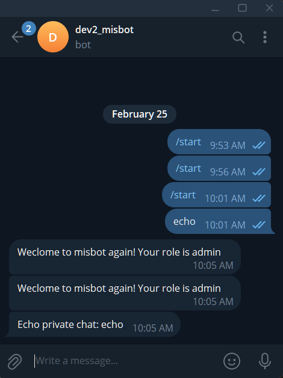
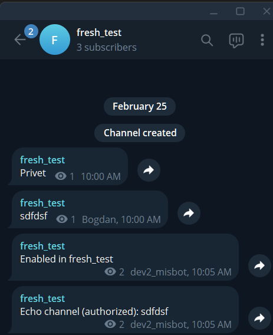
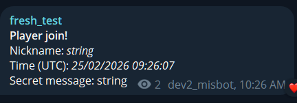
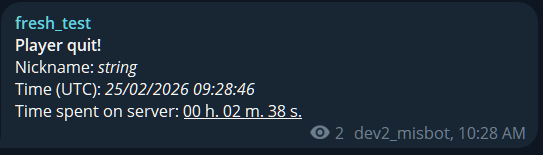

# How to Run the Project Locally

## Bot Creation and Receiving Your IDs

1. In the Telegram app, go to [@BotFather] and create your bot using the `/newbot` command. After providing your bot name and username, you will receive a token in the format like `123456:ABC-DEF1234ghIkl-zyx57W2v1u123ew11`.

2. After that, send a message to your bot and add your bot to any channel as an admin.

3. Then go to `https://api.telegram.org/bot<token>/getUpdates`, replacing `<token>` with your actual token.

4. You will see a response with two updates in the results list. Copy your user ID from the `"message"` update object and the channel ID from the `"my_chat_member"` update object.

```json
{
  "ok": true,
  "result": [
    {
      "update_id": 336436588,
      "message": {
        "message_id": 2,
        "from": {
          "id": "12345" // <<-- Your user ID
        }
      }
    },
    {
      "update_id": 336436589,
      "my_chat_member": {
        "chat": {
          "id": "-12345" // <<-- Your channel ID
        }
      }
    }
  ]
}
```

## Environment File Creation

1. Create a `.dev.env` file in the project directory.

2. Populate it with the following environment variables using your actual values instead of the placeholders:


```
MISBOT_ENVIRONMENT=dev
MISBOT_TELEGRAM_BOT__TOKEN=<Your Bot Token>

# The following can be ignored; they are used in production.
MISBOT_TELEGRAM_BOT__WEBHOOK_SECRET_TOKEN=abc
MISBOT_TELEGRAM_BOT__WEBHOOK_URL=bc://dev.com


MISBOT_DATABASE__SQL_ECHO=True
MISBOT_DATABASE__DB_FILE=/app/db/botdb.sqlite
MISBOT_CHANNEL__ADMIN_USER_ID=<Your user ID, example: "12345">
MISBOT_CHANNEL__MANAGED_CHAT_IDS=<Your list of channel IDs, example: "[-123456]">

MISBOT_AUTH__ISSUER=http://localhost:8080
MISBOT_AUTH__AUDIENCE=http://localhost:8081
MISBOT_AUTH__TOKEN_URL=http://host.containers.internal:8080/token
MISBOT_AUTH__JWKS_URL=http://host.containers.internal:8080/.well-known/jwks.json
```

The configuration is read with pydantic_settings in `src/misbot/config.py`

## Run the authorization server locally and access misbot secured endpoints

1. Pull the [misbot-auth](https://github.com/stratila/misbot-auth) repo
2. Go to the `misbot-auth` directory, create a secrets directory with the private key and the .env file (as described in the README), then build and run the project with `docker compose` or `podman compose`.
3. Create a client with the permissions required to the current app endpoint (currently only `player:write player:read`)
```bash
docker compose -f container-compose.ym exec app uv run misbot-auth-server register-client --client-id localdev --scopes player:write,player:read
```
4. Get authorization token from the auth server using your newly created client credentials
```
curl -X 'POST' \
  'http://localhost:8080/token' \
  -H 'accept: application/json' \
  -H 'Content-Type: application/x-www-form-urlencoded' \
  -d 'grant_type=client_credentials&client_id=localdev&client_secret=PazF9YxWABQhnBzRsdGtVssxxXYH5FMYPxnquuCcQ1Y&scope=player%3Awrite'
```
5. Use the token to get access to the endpoints of the current application.
```
curl --location 'http://localhost:8081/player/join' \
--header 'Content-Type: application/json' \
--header 'Authorization: Bearer {PASTE YOUR TOKEN}' \
--data '{
  "player": {
    "name": "string",
    "uuid": "3fa85f64-5717-4562-b3fc-2c963f66afa6"
  },
  "meta": {
    "message": "string",
    "session_id": "3fa85f64-5717-4562-b3fc-2c963f66afa6"
  }
}'
```


## Run Project

You can use Docker or Podman to run the project locally.

```bash
# Build the image
docker compose -f container-compose.yml build 

# Start containers
docker compose -f container-compose.yml up -d 

# Stop containers
docker compose -f container-compose.yml down
```

Starting the containers currently runs only one `app` container, which performs database migrations and starts the bot app and web server in the event loop:

```bash
# Start containers
docker compose -f container-compose.yml up -d
```

To stop the containers:

```bash
# Stop containers
docker compose -f container-compose.yml down
```

### Restarting the Container After Editing Code

If you make changes to the code and want them to take effect, you can restart the `app` container without rebuilding the entire image:

```bash
# Restart the app container
docker compose -f container-compose.yml restart app
```

This will stop and start the container, applying your code changes immediately.


## Verify Your Bot Works

1. After starting your project using the `up` command, verify the logs:

```
docker compose -f container-compose.yml logs -f app
```

2. Verify that the correct environment variables are set inside the container:

```
docker compose -f container-compose.yml exec app /bin/bash -c "export"
```

3. Verify that the bot echoes messages in the user chat.



4. Verify that the bot has message permissions enabled and echoes messages in the channel.




## Verify That the Server Works and Is Successfully Integrated with the Bot

1. Open the default FastAPI Swagger page at:
   `http://localhost:8080/docs`

2. Find the `POST /player/join` endpoint. Click **"Try it out"**, leave the request body unchanged, and then click **"Execute"**.

3. Verify that the bot sends a **"Player join!"** message to the channel.



4. Find the `POST /player/quit` endpoint. Click **"Try it out"**, leave the request body unchanged, and then click **"Execute"**.

5. Verify that the bot sends a **"Player quit!"** message to the channel.




## Editing DB Schema and Applying Migrations

### Overview

This project works with lightweight SQLite database. In the project itself commnunication with the SQLite is happening throught SQLAlchemy (code `src/misbot/database`) using `aiosqlite` engine. Alembic is used as a migration tool.

The database file is stored in a `sqlite-db` container volume defined in the `container-compose.yml` file.

When container starts it manually applies all unapplied migrations if there are such before starting event loop with server and a bot. Check `entrypoint.sh`.

### Working with migrations

## Creating and Applying Alembic Migrations

### 1. Create a Model

To create a migration, first define (or edit) a model in `src/misbot/database/models.py`:

```python
sample_table = Table(
    "sample_table",
    Base.metadata,
    Column("id", Integer, primary_key=True),
    Column("data", String, nullable=True),
)
```

---

### 2. Generate an Alembic Migration

Create a new Alembic migration using the `--autogenerate` option:

```bash
docker compose -f container-compose.yml exec app alembic revision --autogenerate -m "Add sample table"
```

---

### 3. Verify the Generated Migration File

A new Alembic migration file will be created in the `alembic/versions` directory:

```python
"""Add sample table

Revision ID: 811440fea4ca
Revises: ff9b196aaf18
Create Date: 2026-02-25 09:44:50.690596
"""

from typing import Sequence, Union

import sqlalchemy as sa
from alembic import op

# revision identifiers, used by Alembic.
revision: str = "811440fea4ca"
down_revision: Union[str, Sequence[str], None] = "ff9b196aaf18"
branch_labels: Union[str, Sequence[str], None] = None
depends_on: Union[str, Sequence[str], None] = None


def upgrade() -> None:
    """Upgrade schema."""
    # ### commands auto generated by Alembic - please adjust! ###
    op.create_table(
        "sample_table",
        sa.Column("id", sa.Integer(), nullable=False),
        sa.Column("data", sa.String(), nullable=True),
        sa.PrimaryKeyConstraint("id"),
    )
    # ### end Alembic commands ###


def downgrade() -> None:
    """Downgrade schema."""
    # ### commands auto generated by Alembic - please adjust! ###
    op.drop_table("sample_table")
    # ### end Alembic commands ###
```

---

### 4. Apply the Migration

Apply the migration to your database:

```bash
docker compose -f container-compose.yml exec app alembic upgrade head
```

After applying the migration, you should see a message similar to:

```
INFO  [alembic.runtime.migration] Running upgrade ff9b196aaf18 -> 811440fea4ca, Add sample table
```

---

## Connect to the Database and Verify Table Creation

### 1. Connect to the Database

Use the `sqlite` container to connect to the database and verify that `sample_table` was created:

```bash
docker compose -f container-compose.yml exec sqlite sqlite3 botdb.sqlite
```

Example session:

```
SQLite version 3.45.1 2024-01-30 16:01:20
Enter ".help" for usage hints.
sqlite> .tables
alembic_version  players          time_spent
channels         sample_table     users

sqlite> .schema sample_table
CREATE TABLE sample_table (
        id INTEGER NOT NULL,
        data VARCHAR,
        PRIMARY KEY (id)
);

sqlite> select * from alembic_version;
811440fea4ca
sqlite>
```

---

## Unapply a Migration

If you need to unapply a migration, run the Alembic `downgrade` command and specify the previous revision ID (which can be found in the latest migration file as the `down_revision` value):

```bash
docker compose -f container-compose.yml exec app alembic downgrade ff9b196aaf18
```

In this example, the table will be removed from the database, as defined in the `downgrade()` function of the migration file.

After downgrading, delete the latest migration file if it is no longer needed, and remove a model from `src/misbot/database/models.py` accordingly. 

---

## Further Information

For more details, refer to the official Alembic documentation:

https://alembic.sqlalchemy.org/en/latest/


### Working with Code

### Formatting and Linting

Before committing your changes, run:

```bash
uv run ruff check --fix .
```

```bash
uv run ruff format .
```


[@BotFather]: https://t.me/BotFather